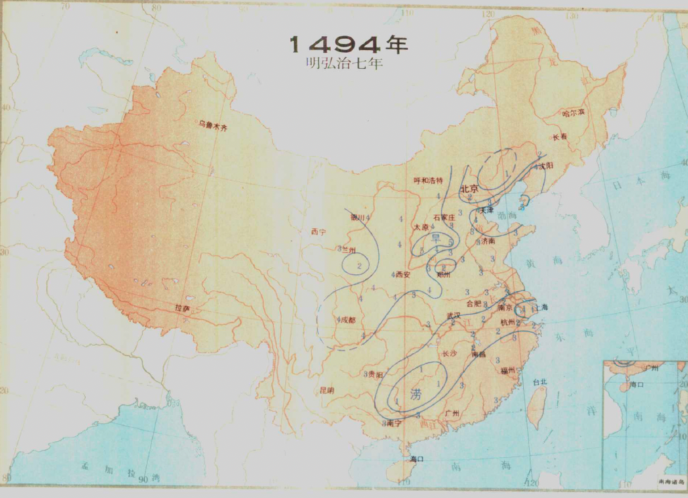
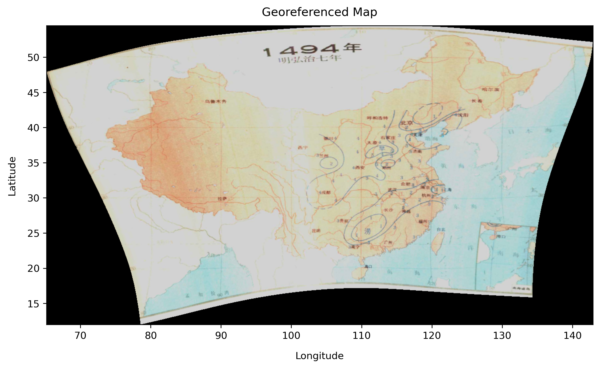

# Historical Map Georeferencing 

This repository provides a lightweight pipeline for georeferencing scanned historical maps that contain a graticule (longitude/latitude grid). It also supports optional extraction of "blue" thematic linework (e.g., isohyets, rivers, boundaries) to GeoJSON for analysis.


## Pipeline

**Pick GCPs** — interactively click graticule intersections and enter lon/lat.  

**Warp** — apply Thin Plate Spline (TPS) to warp the raster into EPSG:4326 GeoTIFF.  

**Visualize & Export** — generate static PNG plots and interactive Leaflet HTML maps.  

**(Optional) Extract blue contours** — convert thematic blue linework to `blue_contours.geojson`.


## Repo Layout

```
historical_map_georef/
├── data/
│   ├── raw/           ## example: original scanned maps (input images)
│   ├── gcps/          ## example: saved GCP (gcps.json)
│   └── outputs/       ## example: georeferenced GeoTIFFs, contours, debug PNGs
│
├── notebooks/
│   └── visualize_and_export.ipynb   ## visualization & export notebook
│
├── scripts/
│   ├── pick_gcps_qt.py              ## interactive GCP picker (Qt)
│   ├── warp_from_gcps.py            ## warp raster to EPSG:4326
│   └── extract_blue_contours.py     ## wxtract thematic blue contours
│
├── environment.yml                  ## conda environment definition
├── README.md                        ## project overview & usage
└── LICENSE                          ## MIT License
```


## Example Data

The sample images in `data/raw/` and referenced in the **Usage** section are taken from: *《中国近五百年旱涝分布图集》*, page 18 (1494 CE, 明弘治七年). These scans are included as examples to demonstrate the workflow. You can substitute your own historical maps following the same pipeline. 




## Setup

Create and activate the environment:

```bash
conda env create -f environment.yml
conda activate geo
python -m ipykernel install --user --name=geo --display-name "Python (geo)"
```


## Usage

### 1) Pick Ground Control Points (GCPs)

```bash
python scripts/pick_gcps_qt.py
```

- Choose your scan from `data/raw/`.
- Click intersections, enter lon/lat (decimal or DMS).
- Press **S** to save → `data/gcps/gcps.json`.

### 2) Warp to GeoTIFF (EPSG:4326)

```bash
python scripts/warp_from_gcps.py \
  "data/raw/map18_1494.png" \
  "data/gcps/gcps.json" \
  "data/outputs/map18_1494_georef.tif"
```

### 3) Visualize & Export

Open Jupyter: 

```bash
jupyter lab  # or jupyter notebook
```

Run `notebooks/visualize_and_export.ipynb` to generate:

- **Georeferenced raster (PNG)**  
  
  

  
- **Georeferenced raster with GCP markers (PNG)**  
  
  

- **Interactive web map (HTML)**  
   
  [View Interactive Folium map](https://yryrena.github.io/historical_map_georef/map18_1494_interactive.html)
  
  [Download interactive Folium map (HTML)](data/outputs/map18_1494_interactive.html) 

### 4) (Optional) Extract blue contours

```bash
python scripts/extract_blue_contours.py \
  "data/outputs/map18_1494_georef.tif" \
  "data/outputs/blue_contours.geojson" \
  --debug-dir "data/outputs/debug"
```

- Writes vectorized blue polylines to GeoJSON.

- Use `--h-min`, `--h-max`, `--s-min`, `--v-min` to tune color thresholds.

- Debug RGB/mask previews are written if `--debug-dir` is set.


## Tips

- Use ≥10–12 well-distributed GCPs, prioritizing printed graticule intersections.
- Validate results in QGIS (overlay with modern basemaps).
- Keep `gcps.json` under version control for reproducibility.
- For empty contour outputs, widen hue range and lower saturation/value thresholds.


## License

MIT License © 2025 Ruiyi Yang
